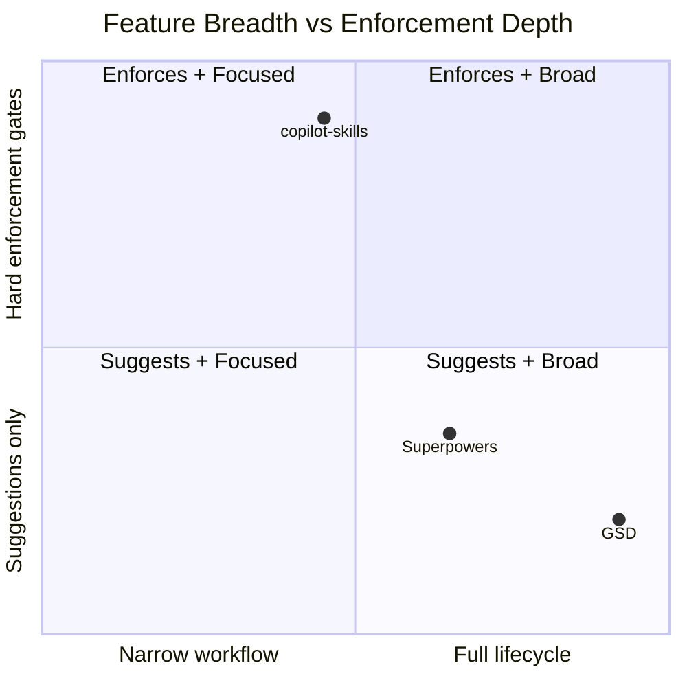
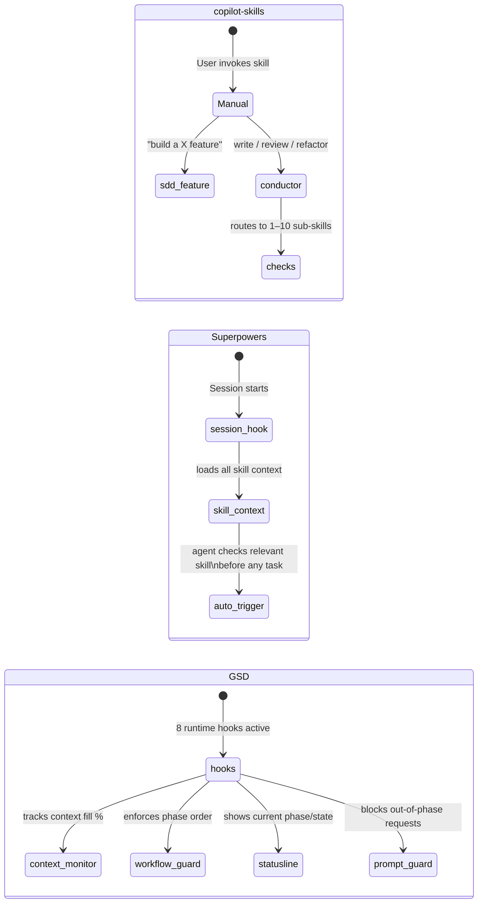
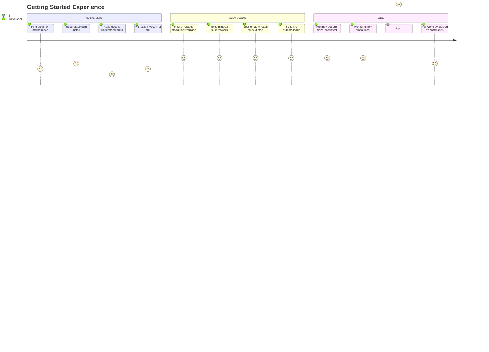
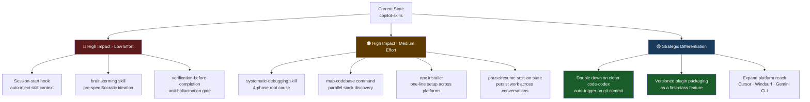
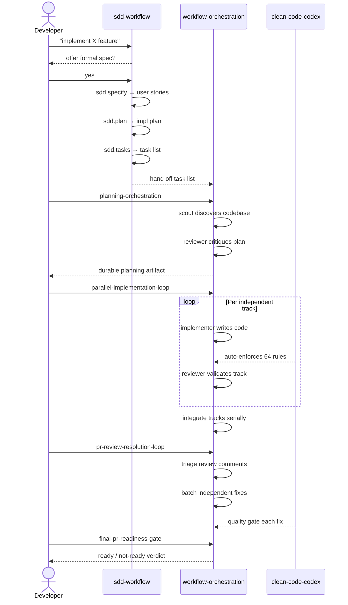

# Plugin Ecosystem Comparison

Comparison of **copilot-skills** against [Superpowers](https://github.com/obra/superpowers) and [GSD](https://github.com/gsd-build/get-shit-done).

---

## Plugin Architecture Overview

```mermaid
graph TB
    subgraph US["🔷 copilot-skills (ours)"]
        direction TB
        US1["clean-code-codex\n10 check sub-skills\nsec · tdd · arch · type\nnaming · size · dead · test\nobs · dep"]
        US2["sdd-workflow\nsdd.specify\nsdd.plan\nsdd.tasks\nsdd-feature-workflow"]
        US3["workflow-orchestration\nplanning-orchestration\nparallel-implementation-loop\npr-review-resolution-loop\nfinal-pr-readiness-gate"]
    end

    subgraph SP["⚡ Superpowers"]
        direction TB
        SP1["brainstorming"]
        SP2["writing-plans"]
        SP3["subagent-driven-development"]
        SP4["test-driven-development"]
        SP5["systematic-debugging"]
        SP6["using-git-worktrees"]
        SP7["finishing-a-development-branch"]
        SP8["dispatching-parallel-agents"]
        SP9["requesting-code-review\nreceiving-code-review"]
        SP10["verification-before-completion"]
        SP11["executing-plans"]
        SP12["writing-skills"]
    end

    subgraph GSD["🚀 GSD"]
        direction TB
        GSD1["/gsd:new-project"]
        GSD2["/gsd:discuss-phase"]
        GSD3["/gsd:plan-phase"]
        GSD4["/gsd:execute-phase"]
        GSD5["/gsd:map-codebase"]
        GSD6["/gsd:debug + forensics"]
        GSD7["20+ specialist agents\n(planner · debugger · doc-writer\nui-auditor · security-auditor…)"]
        GSD8["8 runtime hooks\n(context-monitor · statusline\nworkflow-guard · prompt-guard…)"]
        GSD9["/gsd:autonomous\n/gsd:quick · fast · do"]
        GSD10["pause/resume\nsession state"]
    end
```



---

## End-to-End Developer Workflow

How each system covers the full development lifecycle:

```mermaid
flowchart LR
    IDEA(["💡 Idea"]) --> SPEC["Spec /\nBrainstorm"]
    SPEC --> PLAN["Plan"]
    PLAN --> IMPL["Implement"]
    IMPL --> QUALITY["Quality\nGates"]
    QUALITY --> REVIEW["Code\nReview"]
    REVIEW --> MERGE["Merge /\nShip"]

    IDEA -. "sdd-feature-workflow\nauto-activates" .-> US_SPEC["sdd.specify\nsdd.plan\nsdd.tasks"]
    US_SPEC -. "" .-> US_IMPL["parallel-implementation-loop\nplanning-orchestration"]
    US_IMPL -. "" .-> US_QUALITY["🔷 clean-code-codex\n64 rules auto-enforced"]
    US_QUALITY -. "" .-> US_REVIEW["pr-review-resolution-loop\nfinal-pr-readiness-gate"]

    IDEA -. "brainstorming\nSocratic design" .-> SP_SPEC["writing-plans"]
    SP_SPEC -. "" .-> SP_IMPL["subagent-driven-development\nusing-git-worktrees"]
    SP_IMPL -. "test-driven-development\nverification-before-completion" .-> SP_QUALITY["⚠️ No enforcement\nrules"]
    SP_QUALITY -. "" .-> SP_REVIEW["requesting-code-review\nreceiving-code-review\nfinishing-a-development-branch"]

    IDEA -. "new-project\ndiscuss-phase" .-> GSD_SPEC["plan-phase\nresearch-phase"]
    GSD_SPEC -. "map-codebase\nwave execution" .-> GSD_IMPL["execute-phase\nautonomous"]
    GSD_IMPL -. "validate-phase\nverify-work" .-> GSD_QUALITY["⚠️ No enforcement\nrules"]
    GSD_QUALITY -. "" .-> GSD_REVIEW["review\npr-branch\nship"]

    style US_QUALITY fill:#1a5c2a,color:#fff
    style SP_QUALITY fill:#5c1a1a,color:#fff
    style GSD_QUALITY fill:#5c1a1a,color:#fff
```

---

## Feature Coverage Matrix



---

## Capability Gap Analysis

Green = covered · Red = missing · Yellow = partial

```mermaid
xychart-beta
    title "Capability Coverage Score (0–5)"
    x-axis ["Spec/\nBrainstorm", "Planning", "Impl\nOrchestration", "Code\nQuality", "Security\nScanning", "Debugging", "Session\nState", "Easy\nInstall", "Platform\nReach", "PR\nWorkflow"]
    y-axis "Score" 0 --> 5
    bar [3, 4, 4, 5, 5, 0, 1, 1, 2, 5]
    bar [4, 4, 4, 2, 0, 4, 2, 3, 4, 3]
    bar [4, 5, 5, 1, 2, 4, 4, 5, 5, 3]
```



> **Legend:** Blue = copilot-skills · Orange = Superpowers · Green = GSD

---

## What Each System Auto-Triggers



---

## Installation Experience



---

## Our Gaps — Priority Roadmap



---

## Plugin Composition — How Our Three Plugins Work Together


