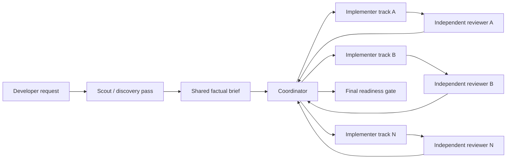
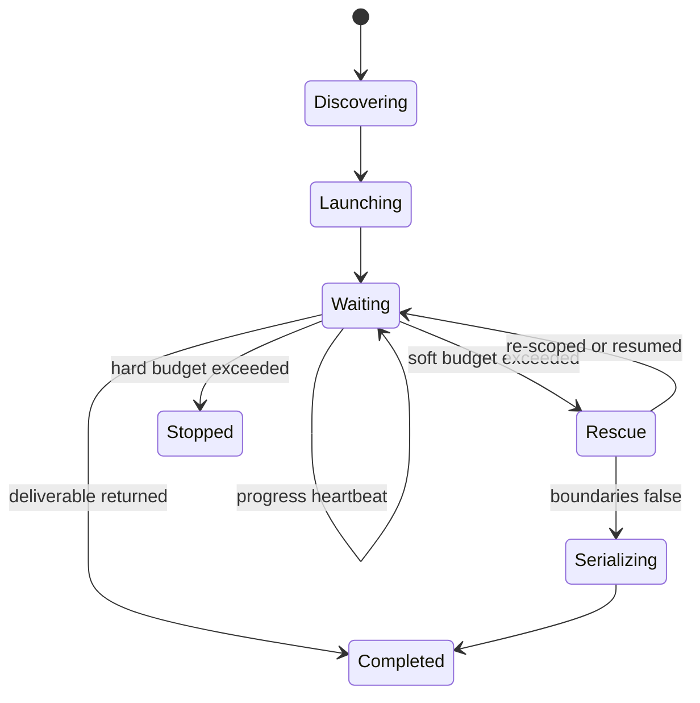
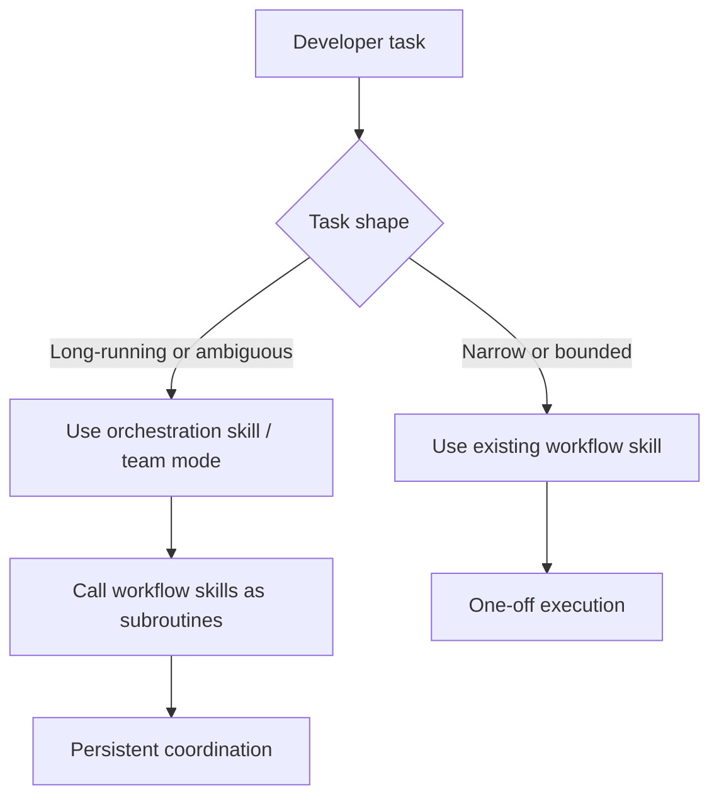

# Coordinator and Subagent Throughput Recommendations

This document captures recommendations for making the workflow skills faster and more reliable when a coordinator delegates work to subagents. The goal is to reduce repeated discovery, prevent premature abandonment, and keep the current quality bar.

## Executive recommendation

**Keep the current three-skill architecture, but change the role topology inside each workflow.** The repo already has a good phase split between implementation, review-resolution, and final readiness. The main issue is not the phase model; it is that the current role contracts push expensive agents to rediscover context and give the coordinator too few options between "wait" and "give up."

### Direct answers

| Question | Recommendation | Why |
| --- | --- | --- |
| 1. Alter the subagent / coordinator setup or roles? | **Yes.** Keep the three skills, but add a cheap scout/discovery role and make the coordinator manage progress, rescue, and escalation explicitly. | The current skills separate implementer and reviewer well, but they do not define a low-cost discovery pass or a strong progress policy. |
| 2. Add quicker / cheap models for context discovery? | **Yes.** Use a fast model for discovery, routing, triage, and large-diff slicing. Do it once per batch or session, not once per track. | This is the highest-leverage latency and cost improvement as long as the cheap model is not trusted with final code judgment. |
| 3. Anything missing? | **Yes.** Add progress-based timeout rules, mandatory handoff artifacts, convergence rules, disagreement handling, and basic orchestration metrics. | Without these, the coordinator still has weak recovery behavior and poor visibility into whether a subagent is slow, stuck, or actually making progress. |

## What the current skills do well

The repo already has strong foundations:

- a clear three-skill lifecycle split;
- explicit role separation between implementers and reviewers;
- strong gates and stop conditions;
- durable artifact templates for track, review-resolution, and readiness outputs.

Those are worth preserving.

## Where the current wording causes slowdowns

Three current patterns are likely driving the issue:

1. `parallel-implementation-loop` explicitly says to keep implementation and review separate and, in Claude Code, to "not share context between roles" (`skills/parallel-implementation-loop/SKILL.md:46-49`).
2. `pr-review-resolution-loop` repeats the same pattern by passing only fix scope to the implementer and only the resulting diff to the reviewer (`skills/pr-review-resolution-loop/SKILL.md:35-40`).
3. All three skills require project-specific inputs before starting, but none define a lightweight discovery tier to gather those inputs once and hand them off (`skills/parallel-implementation-loop/SKILL.md:27-37`, `skills/pr-review-resolution-loop/SKILL.md:21-31`, `skills/final-pr-readiness-gate/SKILL.md:21-29`).

That combination is good for independence, but too strict for throughput. It protects judgment independence, yet it also encourages:

- repeated repo discovery by multiple expensive agents;
- coordinators abandoning slow agents because they cannot tell whether they are blocked or still discovering;
- re-triage after interruptions because artifact creation is encouraged but not central to execution.

## Recommended operating model

### Preserve independence, but share a factual brief

The key change is:

- **do not share authority or conclusions across roles;**
- **do share a coordinator-prepared factual brief across roles.**

That means the reviewer should still form an independent judgment, but it should not have to rediscover the same file set, task boundary, validation commands, or dependency map from scratch.

### Proposed role stack

| Role | Model tier | Responsibility | Output |
| --- | --- | --- | --- |
| Scout / discovery agent | Fast / cheap | Discover repo-specific inputs, narrow files, classify task shape, prepare artifacts | Discovery brief |
| Coordinator | Balanced | Own batching, launch tracks, watch progress, rescue stalled tracks, decide serialize vs parallelize | Track plan, state transitions |
| Implementer | Premium | Make scoped code changes within the brief | Diff, tests, status report |
| Reviewer | Balanced or premium | Review only for substantive issues | Findings with severity |
| Final gate reviewer | Premium | Whole-diff readiness judgment | Final verdict |

### Proposed workflow

## Recommendation 1: add a scout/discovery tier

**Yes, add a fast discovery tier.** This is the most important improvement.

### What the scout should do

The scout should run before expensive implementation or review agents and produce a compact handoff artifact with:

- relevant files and modules;
- confirmed task boundaries;
- validation commands;
- comparison baseline or review surface;
- known dependencies or shared interfaces;
- open questions that still require user input.

The scout should also classify whether the work is:

- a narrow single-track change;
- a true multi-track batch;
- a review-resolution batch;
- a large-diff final readiness pass.

### What the scout should not do

The scout should **not**:

- make final design decisions;
- approve code quality;
- replace the reviewer;
- run long self-reflection loops.

Its job is to prepare and narrow, not to judge.

### When to skip the scout

Skip the scout when the task is already narrow and fully specified, for example:

- one file;
- one well-defined bug fix;
- one known test failure;
- one already-triaged review comment.

Use the scout when there are multiple possible files, unclear boundaries, or multiple parallel tracks.

## Recommendation 2: stop treating "no shared context" as "no shared facts"

The current skills are right to keep implementer and reviewer independent, but "do not share context between roles" is too blunt for the coordinator problem.

Recommended wording change:

> Keep implementation and review judgment separate. The coordinator may share a factual brief that includes task boundaries, files, validation commands, and known dependencies. Do not share proposed conclusions, review verdicts, or "what the reviewer should think."

That preserves independence while removing repeated discovery work.

## Recommendation 3: add progress-based waiting and rescue rules

Right now the coordinator has too little middle ground between waiting and bailing out. Add an explicit state model:

### Suggested policy

1. Give each subagent a **soft budget** and a **hard budget**.
2. If the subagent is still producing progress near the soft budget, keep waiting.
3. If there is no visible progress, run a cheap rescue step:
   - ask the scout to re-scope the task;
   - split the task more narrowly;
   - reduce context;
   - serialize the conflicting part.
4. Only abandon the subagent after:
   - the hard budget is exceeded; and
   - the rescue step cannot recover the track.

The key change is that **lack of completion is not the same as lack of progress**.

## Recommendation 4: make handoff artifacts part of execution, not just documentation

The repo already has good artifact templates in `docs/workflow-artifact-templates.md`. Use them as first-class workflow outputs, not optional reminders.

### Minimum artifacts to require

| Workflow | Required artifact | Purpose |
| --- | --- | --- |
| Parallel implementation | Track report | Prevent rediscovery across tracks and across sessions |
| Review resolution | Resolution summary | Preserve triage decisions and rationale |
| Final readiness | Readiness report | Preserve blockers, follow-ups, and final verdict |

### Recommended artifact content

Every artifact should include:

- work surface;
- owned files or review items;
- validation commands;
- current state;
- unresolved questions;
- next action.

The coordinator should update these artifacts at major state changes instead of relying on chat memory.

## Recommendation 5: add convergence and disagreement rules

Two failure modes are easy to miss:

1. implementer and reviewer can ping-pong on the same issue;
2. reviewer and implementer can disagree without a tie-break.

Recommended additions:

- if the same issue repeats twice, escalate to the coordinator instead of looping locally;
- if a fix grows beyond its original scope, stop and re-scope;
- if implementer and reviewer disagree materially, invoke a higher-trust resolver or escalate to the developer.

These rules are small, but they prevent slow, expensive churn.

## Recommendation 6: add basic orchestration metrics

You do not need a full production observability stack to benefit from a few workflow metrics. Track at least:

| Metric | Why it matters |
| --- | --- |
| Discovery reuse rate | Shows whether expensive agents are still rediscovering context |
| Subagent completion time | Distinguishes slow-but-working from stuck |
| Rescue rate | Shows whether the new rescue policy is useful |
| Abandonment rate | Measures the exact problem this doc is trying to reduce |
| Re-review loops per track | Detects churn |
| Final quality gate failure rate | Confirms that speed improvements are not hurting quality |

If these are not measurable in tooling, at least record them qualitatively in artifacts for a while.

## Recommendation 7: prefer one scout pass per batch, not one per track

If you add a cheap discovery tier, use it **once per batch or session** wherever possible.

Bad pattern:

- coordinator launches three implementers;
- each implementer runs its own scout step;
- each reviewer rediscovers context again.

Better pattern:

- one scout pass prepares a factual brief;
- coordinator splits the work;
- implementers inherit only the slice they need;
- reviewers receive the brief plus the diff.

This is where most of the latency and token savings will come from.

## Agent-to-agent communication: would it help?

**Yes, in a limited and structured form. No, as open-ended conversation.**

Systems like fleets and agent teams can help when a coordinator needs to:

- resend findings for one more revision;
- ask a reviewer to validate a targeted fix;
- pass a scoped artifact from scout to implementer to reviewer;
- recover a partially successful track without starting over.

That is useful here because the current skills are short-lived and mostly assume one-pass delegation. A bounded communication loop would reduce restart cost.

### Where communication helps

It helps most in these cases:

1. **Revision loop:** reviewer returns a small set of substantive issues and the implementer fixes only those.
2. **Rescue loop:** coordinator asks a scout to re-scope a stuck task instead of abandoning it.
3. **Triage loop:** cheap triage agent classifies many comments, then coordinator sends only accepted items to premium implementers.
4. **Readiness loop:** structured checker returns findings, coordinator asks for only targeted fixes, then final reviewer rechecks the stable diff.

### Where communication hurts

It usually hurts when:

- agents debate in freeform without a stop rule;
- the same context is retransmitted repeatedly;
- agents are allowed to negotiate scope instead of receiving scope;
- the reviewer is influenced by the implementer's explanation instead of the code and artifact.

### Best pattern for this repo

Use **artifact-mediated communication**, not free chat.

Recommended message shapes:

- **scout -> coordinator:** discovery brief
- **coordinator -> implementer:** task slice, files, validation, acceptance rules
- **implementer -> reviewer:** diff plus track report
- **reviewer -> coordinator:** findings with severity and exact next action
- **coordinator -> implementer:** targeted resend with only unresolved issues

That gives you the benefit of communication without turning the workflow into an expensive group chat.

### Recommendation

For these skills, add **bounded resend loops** and **structured handoff artifacts**, but do not turn every workflow into persistent agent conversation by default.

## Would a pre-created persistent team be better?

**Usually not for the current skills.** A pre-created squad or long-lived team is better for ongoing, broad, ambiguous work. These skills are currently optimized for **task-shaped, phase-bounded execution**.

### Why persistent teams are attractive

Pre-created teams can help with:

- retained shared memory across many related tasks;
- less coordinator setup on each invocation;
- easier role continuity over a long feature or PR;
- natural support for resend-and-revise loops.

### Why they are not the default answer here

They also add costs:

- more coordination overhead for simple jobs;
- more risk of drift, stale context, and over-delegation;
- less predictable token spend;
- weaker boundaries between implementation, review, and final judgment unless carefully designed.

For this repo specifically, the current strengths are:

- clear skill boundaries;
- strong phase gates;
- reusable, repo-agnostic workflow instructions.

A persistent team model can easily blur those strengths if it becomes the default for every task.

### Better fit: separate orchestration layer

The better pattern is:

1. keep these skills as **reusable workflow protocols** for one-off or bounded work;
2. add a **separate orchestration skill or team mode** for long-running, multi-turn, multi-resend execution.

That gives you two modes:

- **workflow skill mode:** focused, low-overhead, predictable;
- **team orchestration mode:** persistent, conversational, suited for large or evolving work.

### Proposed split

### Recommendation

Do **not** replace the current skills with a permanent pre-created team.

Instead:

1. keep the current skills for bounded execution;
2. create a separate orchestration skill for persistent teams if you want squad-style workflows;
3. let that orchestration skill call these existing skills as subroutines for implementation, review resolution, and final readiness.

## When team orchestration is worth it

A persistent team or fleet-style workflow is worth considering when most of these are true:

- work spans many sessions;
- there are repeated resend loops;
- shared memory materially reduces rediscovery;
- tasks are numerous and loosely coupled;
- the developer wants a manager-like coordinator, not a one-off helper.

If those are not true, the team will often be slower and noisier than a good scout plus short-lived specialists.

## Skill-by-skill changes

### `parallel-implementation-loop`

Recommended changes:

1. Add an optional scout/discovery phase before track launch.
2. Replace "do not share context between roles" with "share factual brief, keep judgment separate."
3. Add soft-budget / hard-budget / rescue behavior for slow tracks.
4. Require a durable track report update before declaring a track complete.
5. Add explicit convergence rules for repeated implementer-reviewer loops.

### `pr-review-resolution-loop`

Recommended changes:

1. Add a cheap triage pass for batching and prioritizing comments.
2. Reuse one review-context artifact across accepted fixes.
3. Preserve reviewer independence, but let the reviewer see the triage summary and affected-file map.
4. Add disagreement resolution for fix-vs-decline conflicts.

### `final-pr-readiness-gate`

Recommended changes:

1. Add a cheap pre-slicer for large diffs so the final reviewer does not spend premium time just finding structure.
2. Reuse the already-known stable review surface instead of rediscovering it.
3. Keep the final verdict premium and whole-diff.
4. Record skipped checks and chunking decisions explicitly in the readiness artifact.

## Suggested rollout order

| Priority | Change | Why |
| --- | --- | --- |
| 1 | Add scout/discovery tier and shared factual brief | Biggest throughput gain |
| 2 | Add progress-based waiting, rescue, and abandonment policy | Directly addresses coordinator giving up too early |
| 3 | Make artifacts operational and durable | Enables resumability and less rediscovery |
| 4 | Add convergence and disagreement rules | Cuts wasteful loops |
| 5 | Add lightweight orchestration metrics | Confirms the changes are helping |

## Final recommendation

The best path is **not** to replace the current skill set or merge the skills into one larger orchestration prompt.

Instead:

1. **Keep the three-skill architecture.**
2. **Add one fast scout/discovery role.**
3. **Let the coordinator share a factual brief, not conclusions.**
4. **Teach the coordinator to rescue or re-scope before abandoning slow subagents.**
5. **Make artifacts and progress tracking part of normal execution.**

That combination should make the workflows faster, cheaper, and more resilient without weakening review independence or the final quality gate.

## External references

These recommendations align with current guidance on multi-agent orchestration, dynamic routing, and latency reduction:

- Microsoft ISE, ["Patterns for Building a Scalable Multi-Agent System"](https://devblogs.microsoft.com/ise/multi-agent-systems-at-scale/)
- AWS, ["Multi-LLM routing strategies for generative AI applications on AWS"](https://aws.amazon.com/blogs/machine-learning/multi-llm-routing-strategies-for-generative-ai-applications-on-aws/)
- ProAgenticWorkflows, ["Optimizing AI Agentic Workflows: Reducing LLM Calls for Enhanced Efficiency"](https://proagenticworkflows.ai/optimizing-ai-agentic-workflows-reducing-llm-calls)
