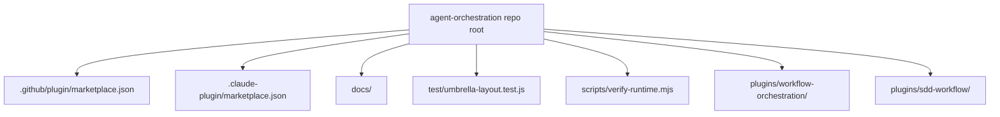

# Marketplace Overview

`agent-orchestration` is an umbrella repo and marketplace source for multiple installable plugins.

## Current layout

## Responsibilities

- **Repo root**: umbrella docs, marketplace metadata, aggregate validation
- **`plugins/workflow-orchestration/`**: planning and workflow-loop plugin
- **`plugins/sdd-workflow/`**: companion SDD plugin bundle

The plugin identities stay precise even though the marketplace is shared.

