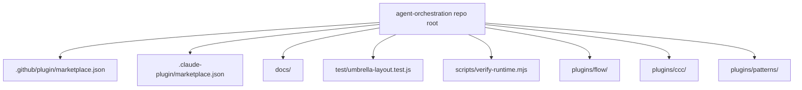

# Marketplace Overview

`agent-orchestration` is an umbrella repo and marketplace source for multiple installable plugins.

## Current layout

## Responsibilities

- **Repo root**: umbrella docs, marketplace metadata, aggregate validation
- **`plugins/flow/`**: unified planning, workflow-loop, and SDD plugin
- **`plugins/ccc/`**: clean-code enforcement and audit plugin
- **`plugins/patterns/`**: PEAA, GoF, and DDD design patterns plugin

The plugin identities stay precise even though the marketplace is shared.
