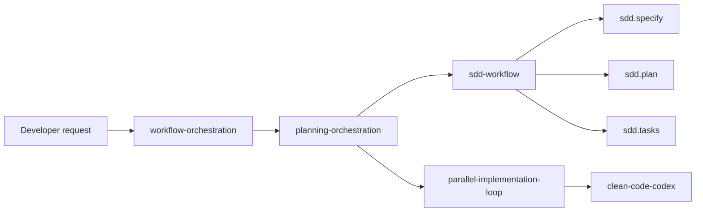

# Plugin Composition

`workflow-orchestration`, `sdd-workflow`, and `clean-code-codex` are separate plugins that can be installed independently or together.

## Composition model

## When to install multiple plugins

Install multiple plugins together when you want:

- planning that can optionally delegate to SDD;
- explicit `sdd.specify`, `sdd.plan`, and `sdd.tasks` commands;
- clean-code enforcement and targeted review checks from Codex;
- one repo-local marketplace source for all three plugins.

## When to install only one

- Install only **`workflow-orchestration`** when you want execution, review-resolution, and readiness workflows without SDD.
- Install only **`sdd-workflow`** when you want spec/plan/tasks generation without the orchestration loops.
- Install only **`clean-code-codex`** when you want clean-code audits and enforcement without the workflow orchestration loops.
