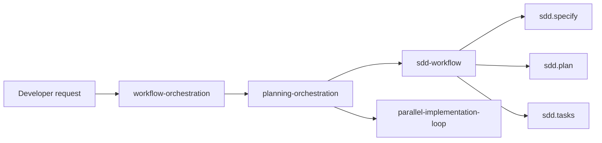

# Plugin Composition

`workflow-orchestration` and `sdd-workflow` are separate plugins that can be installed independently or together.

## Composition model

## When to install both

Install both plugins when you want:

- planning that can optionally delegate to SDD;
- explicit `sdd.specify`, `sdd.plan`, and `sdd.tasks` commands;
- one repo-local marketplace source for both plugins.

## When to install only one

- Install only **`workflow-orchestration`** when you want execution, review-resolution, and readiness workflows without SDD.
- Install only **`sdd-workflow`** when you want spec/plan/tasks generation without the orchestration loops.

