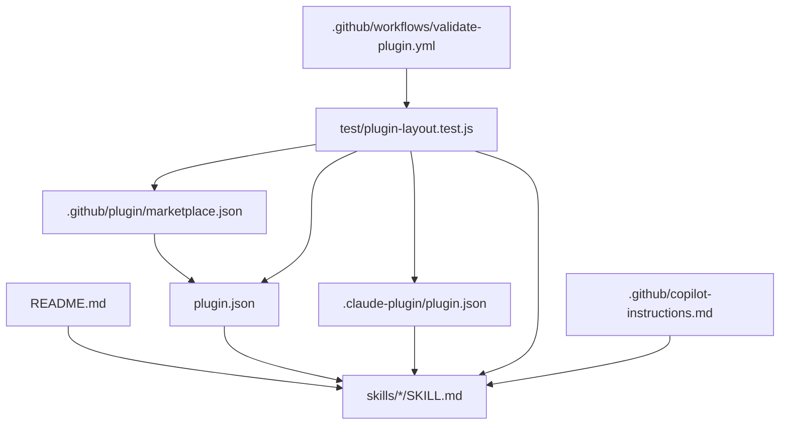
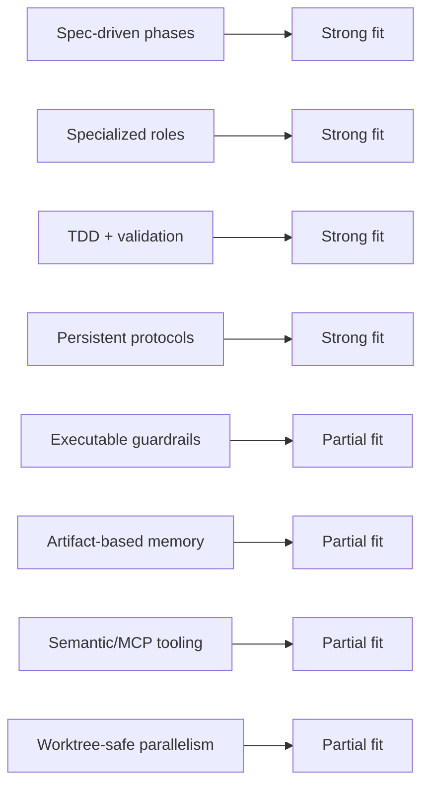
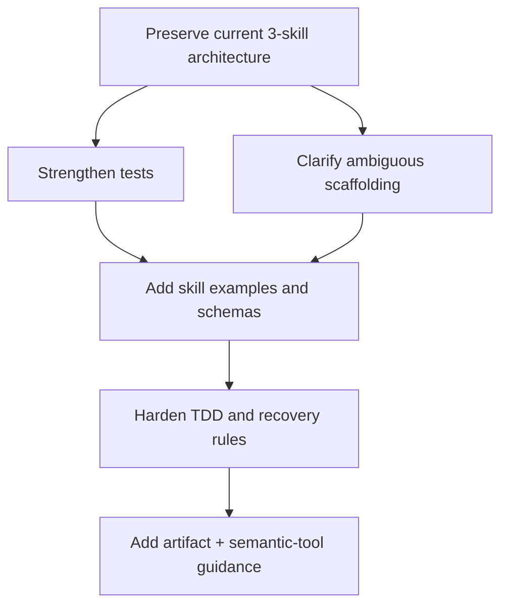

# Skills Evaluation

This document evaluates the workflow skills and packaging structure in this repository, compares them with the themes in the companion `ai-agent-dev-summary.md` reference used during the original review, and synthesizes two independent deep reviews run with `claude-opus-4.6` and `gpt-5.4`.

## Executive summary

This repository already has a strong core: a single shared `skills/` tree, clear separation between implementation, review-resolution, and final readiness, and a plugin-first packaging model that works across GitHub Copilot CLI and Claude Code.

Most of the first-wave recommendations from this review are now complete on `feat/skills-followups`. The repo is materially stronger than when this document was first written:

- tests now validate section coverage, frontmatter-to-directory alignment, metadata sync, and the packaged tarball contents;
- the previously unneeded scaffolding has been removed;
- all three skills now include examples, and the weaker skills now include stop conditions and clearer recovery guidance.

The main remaining gap is now procedural rather than structural:

- the current runtime verification is intentionally opt-in developer validation rather than a CI gate.

Both subagent reviews agreed on the same broad recommendation: preserve the current skill decomposition and gate-driven style, then strengthen the repository's executable guardrails and reduce ambiguity around artifacts and packaging. That guidance still holds, but a large part of it has now been implemented.

## Current implementation status

| Recommendation area | Status | Notes |
| --- | --- | --- |
| Stronger skill-layout tests | Complete | Tests now enforce more required sections, frontmatter name alignment, and metadata consistency. |
| Packaging smoke coverage | Complete | `npm pack --json --dry-run` is exercised in the test suite. |
| Runtime-level verification | Complete | The repo now provides `npm run validate:runtime` for isolated Copilot install/list/uninstall and real plugin loading checks in both Copilot CLI and Claude Code. |
| Example content in skills | Complete | Added example track definition, thread responses, and readiness report. |
| Stronger TDD/recovery guidance | Complete | Parallel skill tightened to `must`; weaker skills gained stop conditions and recovery language. |
| Semantic-tool guidance | Complete | Final readiness skill now prefers semantic/MCP/LSP-style checkers when available. |
| Review priority ordering | Complete | Added to `pr-review-resolution-loop`. |
| README contributor guidance | Complete | README now covers skill editing, adding skills, package verification, and manifest path conventions. |
| Ambiguous scaffolding cleanup | Complete | The removed scaffolding is no longer part of the tracked repo shape. |
| Durable artifact/report expectations | Complete | `docs/workflow-artifact-templates.md` now defines canonical artifact locations and templates for track reports, review-resolution summaries, and readiness reports. |
| Additional repo docs (`CONTRIBUTING.md`, Claude repo instructions) | Complete | The repo now includes `CONTRIBUTING.md` and `CLAUDE.md` alongside the existing Copilot instructions. |
| `CHANGELOG.md` | Complete | The repo now includes a lightweight changelog with an unreleased section and the current plugin baseline. |

## What is already strong

### 1. Clear lifecycle separation

The repository models three distinct phases instead of one overloaded workflow:

- `parallel-implementation-loop`
- `pr-review-resolution-loop`
- `final-pr-readiness-gate`

That matches the repository's stated intent in `README.md` and keeps each skill focused.

### 2. Strong protocol-like skill writing

The skill files read like operating procedures rather than vague prompts. The best examples are:

- explicit gates;
- explicit stop conditions;
- separate implementer and reviewer roles;
- explicit project-specific inputs before execution.

This aligns well with the "persistent instructions as protocols" theme in `ai-agent-dev-summary.md`.

### 3. Good plugin architecture

The packaging model is simple and sound:

- `skills/*/SKILL.md` is the shared source of truth;
- `plugin.json` targets Copilot CLI;
- `.claude-plugin/plugin.json` targets Claude Code;
- `.github/plugin/marketplace.json` layers marketplace metadata on top.

### 4. Good review philosophy

The review-resolution skill has one of the strongest repo-specific ideas in the project:

- triage comments into `fix`, `decline`, or `clarify first`;
- do not silently decline feedback;
- do not assume all review comments are correct.

That is higher quality than most generic "address PR comments" workflows.

## Repository architecture

## Skill-by-skill evaluation

## `parallel-implementation-loop`

### Strengths

- Best operational detail of the three skills.
- Strong guidance on only parallelizing truly independent work.
- Good separation between implementer and reviewer roles.
- Good batch and track gates.
- Good cleanup language for temporary work surfaces.

### Weaknesses

- It still assumes upstream artifacts already exist: requirements, plan, tasks, dependency notes, validation commands.
- It still says tracks should record state, but does not define a repository-level durable artifact format.

### Recommended changes

- Complete: added an example track definition block.
- Complete: recommended a safe default like `2-3` concurrent tracks.
- Complete: upgraded TDD wording from `should` to `must`.
- Complete: the repository now provides canonical workflow artifact templates outside the skill prose.

## `pr-review-resolution-loop`

### Strengths

- Strong triage model: `fix`, `decline`, `clarify first`.
- Strong emphasis on thread closure rather than code-only resolution.
- Good discipline around minimal fixes and separate review.
- Good reminder not to act on stale comments blindly.

### Weaknesses

- It is still lighter on artifact expectations than on procedural guidance.
- It does not yet define a canonical place to persist thread-resolution summaries outside the conversation.

### Recommended changes

- Complete: added a `Stop Conditions` section.
- Complete: added example response templates for `fixed`, `declined`, and `clarify first`.
- Complete: added a priority order such as security -> correctness -> contract -> test gaps -> architecture.
- Complete: cross-referenced the implementation skill using the plugin-qualified form.

## `final-pr-readiness-gate`

### Strengths

- Strong framing around a stable integrated diff.
- Good distinction between code-bearing and docs/config-only diffs.
- Good verdict model: `ready for review`, `ready with follow-ups`, `not ready`, `stopped by user`.
- Good idea of running structured checks in report-only mode before whole-diff judgment.

### Weaknesses

- Still the most abstract of the three skills, even after improvement.
- The readiness report shape now exists in the skill, but it is still illustrative rather than enforced anywhere else in the repo.

### Recommended changes

- Complete: added a standard readiness report schema example.
- Complete: added examples of structured checkers, including semantic and MCP-backed tools when available.
- Complete: added stop/recovery conditions for unstable diffs or conflicting findings.
- Complete: added a recommendation for large-diff chunking or time-boxing.

## Comparison with `ai-agent-dev-summary.md`

## Alignment

The repository aligns well with several major themes from the summary:

| Theme from summary | Fit in this repo | Notes |
| --- | --- | --- |
| Spec-driven or phase-based development | Strong | The skills are staged and written as explicit reusable workflows rather than ad hoc prompts. |
| Separate planning from implementation | Strong | The implementation skill explicitly says it is not a planning skill. |
| TDD and validation loops | Strong | The skills call for TDD and validation, and the test suite now enforces much more of the documented contract. |
| Specialized subagents | Strong | All three skills define reviewer/implementer or reviewer/checker role separation. |
| Persistent instructions as protocols | Strong | The skill files and `.github/copilot-instructions.md` act as versioned operating manuals. |

## Gaps

The comparison also exposed a few meaningful gaps:

| Theme from summary | Gap in this repo | Why it matters |
| --- | --- | --- |
| Hooks and guardrails close to the edit point | Partial | Automation now checks content structure and package surface, but it still does not exercise real runtime loading in Copilot CLI or Claude Code. |
| Semantic tools over grep | Partial | The readiness skill now prefers semantic/MCP/LSP-style checkers, but the repo does not bundle such tooling itself. |
| Artifact-based memory | Complete | Skills now require durable artifact production as a gate condition; templates extended with state, next-action, and outcome fields. |
| Adversarial review and self-critique | Complete | Convergence rules, disagreement escalation, and maximum revision rounds now specified in all three skills. |
| Safe parallelism with worktrees | Partial | Worktrees and sandboxes are mentioned, but not elevated as the default safe strategy. |

## Best-practice fit map

## Synthesized subagent findings

Both independent reviews converged on these points:

1. Preserve the current three-skill split.
2. Preserve the protocol-like style and explicit gates.
3. Improve tests so they validate more than file presence and a few headings.
4. Reduce ambiguity around unfinished or duplicated scaffolding.
5. Add examples and output schemas so the skills are easier to execute consistently.

There were also slight differences in emphasis:

- The `claude-opus-4.6` review emphasized unfinished scaffolding, metadata drift risks, and the need for stronger content-quality tests.
- The `gpt-5.4` review emphasized usage realism, worked examples, and better stop/recovery behavior in the latter two skills.

Those are complementary rather than conflicting.

Status update: the repository has now addressed the strongest overlap between those two reviews. The remaining work is mostly optional hardening and contributor-experience improvements rather than core workflow correctness.

## Recommended changes

## Completed

### 1. Strengthen tests beyond structural shape

Done:

- require key sections beyond `## Purpose` and `## Project-Specific Inputs`;
- verify metadata sync across `package.json`, `plugin.json`, `.claude-plugin/plugin.json`, and `.github/plugin/marketplace.json`;
- verify that skill frontmatter `name` matches the containing directory.

### 2. Clarify unfinished or ambiguous scaffolding

Done: the previously unneeded scaffolding was removed, so this is no longer an active repo problem.

### 3. Add examples and report schemas to the skills

Done:

- example track definitions for the implementation loop;
- example thread responses for the review-resolution loop;
- example readiness report schema for the final gate.

### 4. Harden TDD language

Done in `parallel-implementation-loop`, which was the clearest high-value target.

### 5. Add stop/recovery sections where they are currently thin

Done for the review-resolution and final-readiness skills.

### 6. Add semantic-tool guidance to the final gate

Done.

### 7. Document priority ordering in review-resolution

Done.

### 8. Explain path differences between Copilot and Claude manifests

Done in the README.

### 9. Improve README contributor guidance

Done.

### 10. Add packaging smoke coverage

Done with an `npm pack --json --dry-run` based test.

## Remaining

No substantive documentation recommendations remain from the original review.

The only notable open choice is whether runtime verification should remain a developer-run command or eventually become part of a stricter CI path.

## Recommendation roadmap

## Final assessment

This repository already fits many of the best practices in `ai-agent-dev-summary.md`, especially the emphasis on phase-based workflows, specialized roles, and durable protocol-style instructions.

The highest-value recommendations from the original review are now complete. The repo has moved from "good reusable skill pack with soft spots" to "well-guarded reusable skill pack with stronger tests, clearer skill contracts, and better packaging verification."

The remaining work is now about deciding how much live-runtime verification belongs in CI rather than about missing repository guidance.
