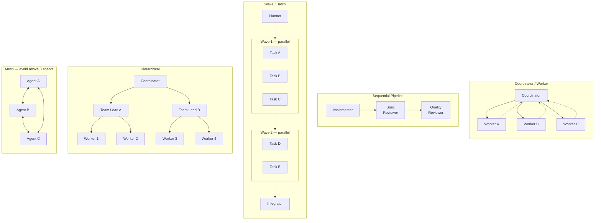
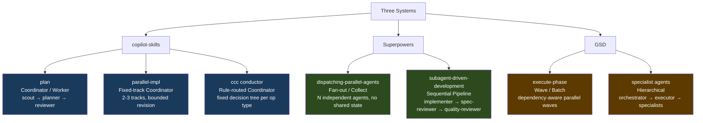
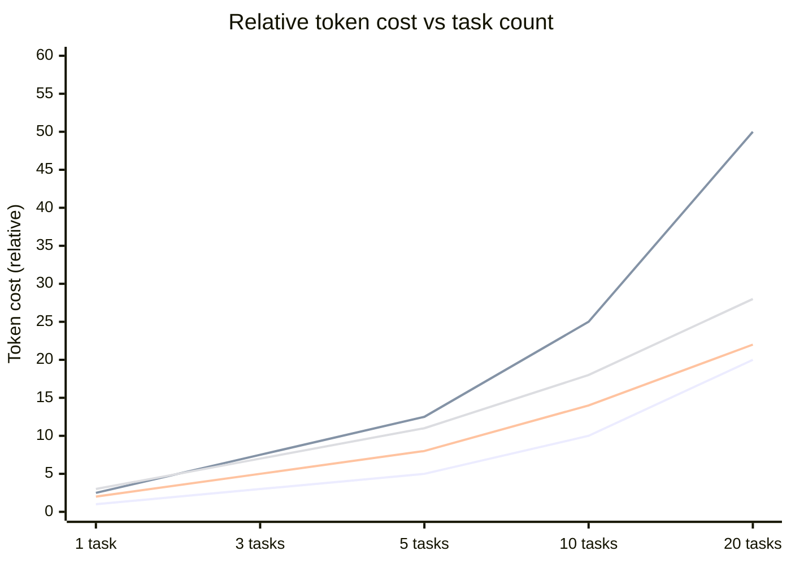
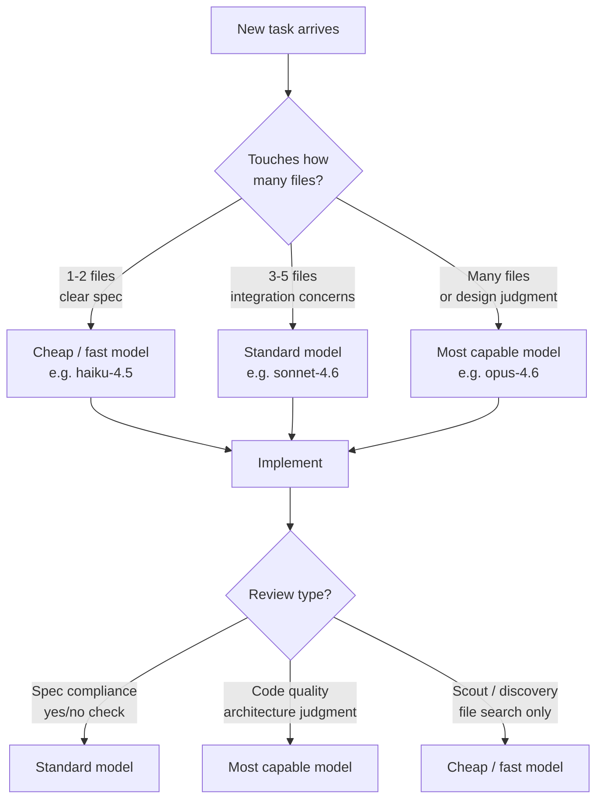
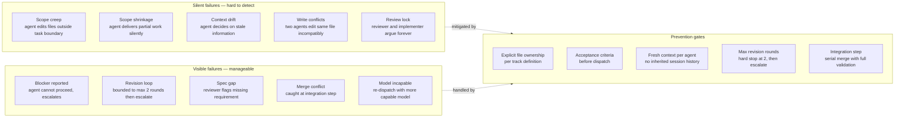
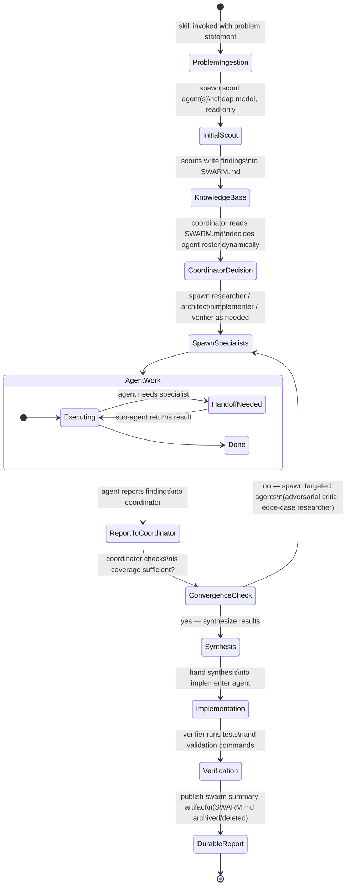
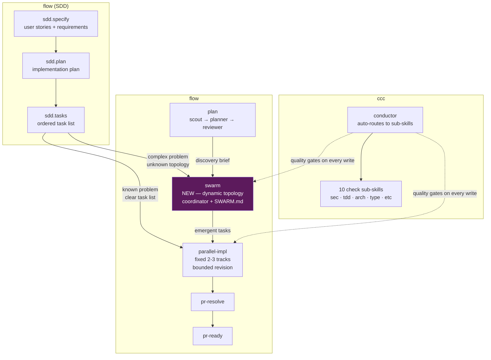
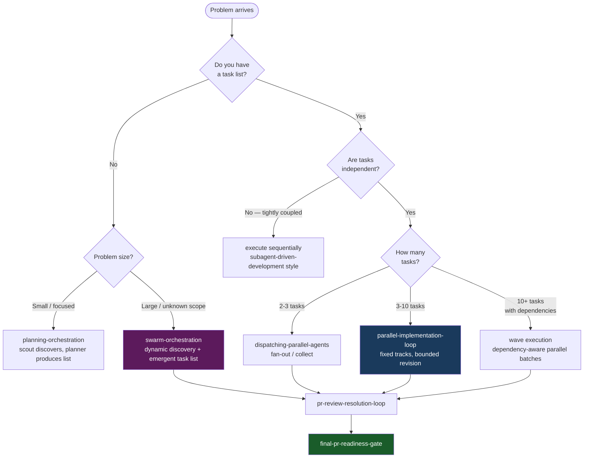

# Swarm Orchestration

Visual reference for swarm orchestration patterns, tradeoffs, and the proposed
`swarm-orchestration` skill design.

---

## The Five Coordination Topologies

---

## Which Pattern Each System Uses

---

## What None of Them Have — The True Swarm Gap

```mermaid
flowchart LR
    subgraph FIXED["What all three do\nFixed topology"]
        direction TB
        F1["You decide the agent roster BEFORE execution"]
        F2["Coordinator routes to pre-defined roles"]
        F3["Topology is static — plan then execute"]
    end

    subgraph SWARM["What true swarm adds\nEmergent topology"]
        direction TB
        S1["Coordinator discovers problem shape DURING execution"]
        S2["Spawns agents based on what scouts find"]
        S3["Agents hand off to specialists mid-task"]
        S4["Shared knowledge base feeds all agents"]
        S5["Plan evolves as findings come in"]
    end

    FIXED -. "gap" .-> SWARM

    subgraph GAP["The four missing capabilities"]
        direction TB
        G1["Dynamic task decomposition\nplanner agent splits work at runtime"]
        G2["Agent-to-agent handoffs\nimplementer delegates to specialist mid-task"]
        G3["Shared working memory\nSWARM.md all agents read and write"]
        G4["Adaptive re-planning\ncoordinator adjusts based on findings"]
    end

    SWARM --> GAP
```

---

## Token Cost by Pattern

> **Legend (bottom to top):** Simple parallel (1x) · Subagent pipeline (2.5x) · Wave/batch (2x amortized) · Coordinator swarm (2.5–3x)
>
> Wave/batch cheapens per task because the planner cost is amortized across many tasks.

---

## Per-Role Model Selection

Cost optimization used by GSD and Superpowers — only our `parallel-implementation-loop` partially does this today.

---

## Silent Failures vs Visible Failures

---

## Proposed swarm-orchestration Skill — Internal Flow

---

## How swarm-orchestration Fits Our Plugin Stack

---

## Decision Guide — Which Pattern to Use

