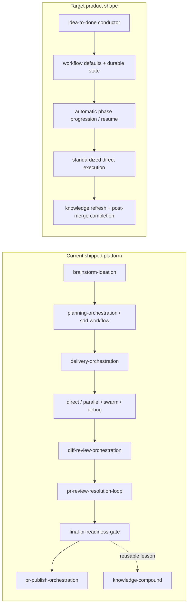
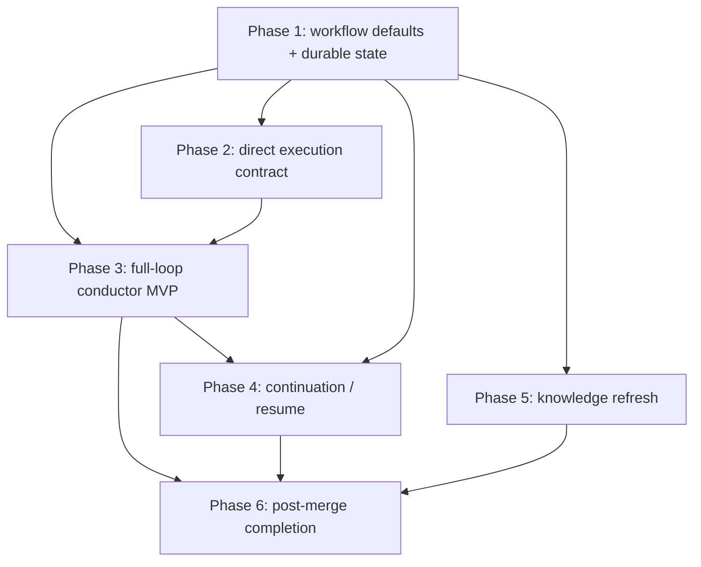

# Workflow Roadmap: from workflow platform to opt-in idea-to-done automation

## Discovery brief

```text
Task summary: define the post-1.6 phase-based roadmap focused on the remaining productization gaps after workflow-orchestration shipped the defaults/state foundation.
Planning mode: fallback planning
Relevant files: docs/everyinc-compound-engineering-comparison.md, docs/workflow-roadmap.md, plugins/workflow-orchestration/docs/workflow-usage-guide.md, plugins/workflow-orchestration/README.md, plugins/workflow-orchestration/skills/*
Validation commands: npm test, npm run validate:plugin, npm run validate:runtime
Task boundaries: in scope = roadmap phases for lifecycle automation, workflow defaults, continuation, knowledge refresh, and direct-execution hardening; out of scope = packaging/distribution expansion, persona sprawl, mega-skill rewrites
Dependencies: preserve current workflow contracts; build thin coordinators over existing skills; keep Codex as the quality gate rather than inventing a parallel quality system
Recommended next action: start Phase 2 and standardize the direct execution contract before adding a top-level conductor
Unresolved questions: none that block roadmap definition
Workflow outcome measures: clearer sequencing, explicit rationale per phase, roadmap aligned to the current shipped workflow platform
```

## Roadmap focus

The repo has crossed the important threshold from **specialist skills** to **workflow platform**. It now supports most major engineering phases:

> ideate -> plan -> deliver -> review -> resolve -> gate -> publish -> capture knowledge

This roadmap therefore optimizes for a different goal:

> turn phase coverage into lifecycle automation without collapsing into mega-skills

## Current state vs target state



## The gaps this roadmap addresses

These are the remaining product gaps after `1.6.0`:

1. **No top-level full-loop conductor**
   - there is still no single workflow that owns:
     `brainstorm -> plan -> deliver -> review -> resolve -> gate -> publish -> capture`
2. **Automatic progression is weak**
   - most handoffs are recommendations, not chained lifecycle steps
3. **Knowledge capture exists, but maintenance does not**
   - there is no `knowledge-refresh` equivalent for stale, duplicate, or obsolete learnings
4. **Direct execution is useful but too thin**
   - `delivery-orchestration` can route to direct implementation, but that path is not yet a first-class portable contract
5. **Post-PR completion is fragmented**
   - PR publication and release are correctly separated, but there is no bigger completion story for teams that want a "finish the job" loop

## Roadmap principles

1. **Add lifecycle glue, not more specialist sprawl.**  
   The repo does not need more isolated skills before it needs better sequencing.

2. **Prefer thin conductors over new monoliths.**  
   The right move is a coordinator that invokes existing workflows, not a single 700-line skill that reimplements them.

3. **Make automation opt-in and inspectable.**  
   A developer should be able to choose between:
   - phase-by-phase manual control;
   - guided auto-progression;
   - full-loop automation.

4. **Standardize state before increasing autonomy.**  
   Defaults, artifact sinks, and workflow state need to be more explicit before automatic progression becomes safe.

5. **Keep current entry points valid.**  
   Existing workflows should remain first-class entry points even after a top-level conductor exists.

6. **Do not copy compound engineering's weak points.**  
   No mega-skills, no persona zoo, no company-taste workflows, no mandatory hard-coded taxonomy.

## Phase roadmap

## Current progress

- **Completed in `1.7.0`**: Phase 1 — workflow defaults and durable state foundation; Phase 2 — standardized direct execution contract
- **Current phase**: Phase 3 — full-loop conductor MVP
- **Later phases**: continuation/resume, knowledge refresh, and post-merge completion remain roadmap items

Phase 1 is now the shipped foundation rather than the next milestone. The roadmap should therefore be read as "what comes after the defaults/state contract landed."

## Phase 1 — workflow defaults and durable state foundation

**Status:** completed in `1.6.0`

**Goal:** define the minimum shared contract that lets higher-level automation behave consistently across repositories and sessions.

### What this phase adds

1. **Workflow defaults config**
   - a repo-level configuration surface for:
     - default artifact sinks;
     - preferred review mode;
     - auto-progression policy;
     - knowledge-capture defaults;
     - publish / post-merge preferences.
2. **Shared workflow state contract**
   - a lightweight machine-readable state artifact that records:
     - current phase;
     - latest durable artifacts;
     - next recommended action;
     - whether the workflow is manual, guided, or auto-progressing.
3. **Artifact sink normalization**
   - documented repo-configured defaults for ideation, planning, review, publish, and knowledge artifacts.
4. **Guardrails for automation**
   - explicit rules for when a workflow may auto-progress and when it must stop for human confirmation.

### Why it is important

This is the most important enabling phase even though it is not the flashiest one.

Without this phase:

- a conductor will not know where to write or read durable artifacts;
- continuation across sessions will stay brittle;
- automatic progression will feel magical and unsafe;
- knowledge capture will remain too manual for reliable reuse.

This phase turns the current workflow system from "good prompts with docs" into a platform with a shared operating contract.

### Recommended deliverables

1. **A workflow defaults schema**
   - likely repo-local, simple, and intentionally narrow
2. **A durable workflow-state artifact contract**
   - separate from transient session state
3. **Docs**
   - explain the config keys, default behavior, and override rules
4. **Light workflow integration**
   - `planning-orchestration`, `diff-review-orchestration`, `pr-publish-orchestration`, and `knowledge-compound` should read the shared defaults when present

### Exit criteria

- repositories can declare workflow defaults without editing individual skill prompts;
- durable artifact destinations are no longer ambiguous by default;
- a later conductor can inspect workflow state without scraping chat history.

### Progress update

This phase is complete. The repo now ships:

- `plugins/workflow-orchestration/docs/workflow-defaults-contract.md`
- `plugins/workflow-orchestration/docs/workflow-state-contract.md`
- the session-boundary clarification in `plugins/workflow-orchestration/docs/session-md-schema.md`
- lightweight defaults adoption in `planning-orchestration`,
  `diff-review-orchestration`, `pr-publish-orchestration`, and
  `knowledge-compound`
- product/docs/test/version alignment for the `1.6.0` release surface

The next roadmap phase should build on this contract rather than redefining it.

## Phase 2 — standardized direct execution contract

**Status:** next recommended phase

**Goal:** make the "direct" path under `delivery-orchestration` a real product surface instead of a thin runtime convenience.

### What this phase adds

1. **Direct execution contract**
   - explicit inputs, expected outputs, validation expectations, and handoff behavior for the single-slice implementation path
2. **Durable direct-execution reporting**
   - track report or delivery artifact for direct implementation, just like parallel and swarm already have stronger structure
3. **Review handoff normalization**
   - standard way to pass:
     - diff surface;
     - validation result;
     - artifact references;
     - recommended review mode
4. **Failure / rescue policy**
   - narrow, escalate, or re-route to debugging / planning / swarm when the direct path was the wrong choice

### Why it is important

Today the repo is strongest when the work is either:

- parallelizable;
- swarm-worthy;
- debugging-shaped.

But many real requests are small, bounded, and should succeed through one clean direct path. If that path stays underspecified, the future conductor will have a hole in the middle of the most common usage pattern.

This phase reduces that risk by making the "simple path" just as productized as the complex paths.

### Recommended deliverables

1. update the `delivery-orchestration` contract to make the direct path explicit;
2. add a durable report template for direct execution outcomes;
3. define re-route rules when direct execution was misclassified;
4. document the direct path in the workflow guide and README.

### Exit criteria

- the direct path is a documented, durable, inspectable workflow outcome;
- direct execution can hand off to review the same way other execution routes do;
- the future conductor can safely rely on direct execution as a first-class option.

## Phase 3 — full-loop conductor MVP

**Goal:** introduce one opt-in top-level workflow that can carry clarified work across the major existing phases.

### What this phase adds

1. **`idea-to-done` conductor (working name)**
   - thin coordinator over existing skills
   - does not replace ideation, planning, delivery, review, readiness, publication, or knowledge workflows
2. **Mode selection**
   - manual phase-by-phase mode;
   - guided mode with explicit stop points;
   - auto-progress mode with guardrails from Phase 1
3. **Lifecycle ownership**
   - the conductor owns sequencing across:
     - ideation or planning entry;
     - delivery routing;
     - review;
     - readiness;
     - publication;
     - optional knowledge capture.
4. **Clear stop boundaries**
   - stop when:
     - requirements are still unclear;
     - a human decision is required;
     - readiness is not achieved;
     - release or merge policy demands a separate step.

### Why it is important

This is the highest-leverage phase in the roadmap.

The repo already has most of the pieces. What is missing is the product surface that makes a developer say:

> "I can start with a clarified request and let the system take me to a publish-ready result."

This phase closes the biggest remaining gap with compound engineering while preserving the repo's stronger architectural discipline.

### Recommended deliverables

1. **conductor contract**
   - accepted inputs;
   - progression modes;
   - stop conditions;
   - artifact requirements
2. **phase sequencing rules**
   - when to skip ideation;
   - when to invoke planning;
   - when to auto-enter review after delivery;
   - when to recommend or auto-run knowledge capture
3. **state updates**
   - the conductor should update the durable workflow-state artifact at every major phase boundary
4. **docs**
   - one "start here if you want the whole loop" path

### Exit criteria

- the repo has one obvious opt-in workflow for clarified work;
- the conductor stays coordinator-shaped and routes to existing skills;
- manual entry into any specialist workflow still remains valid.

## Phase 4 — continuation, resume, and next-ready progression

**Goal:** make interrupted or multi-session work resumable without re-deriving the workflow state from scratch.

### What this phase adds

1. **Resume / continuation workflow**
   - inspect durable state and artifacts;
   - determine the latest completed phase;
   - recommend or trigger the next valid phase.
2. **Next-ready logic**
   - understands whether the next step is:
     - more clarification;
     - planning;
     - delivery;
     - review resolution;
     - readiness;
     - publication;
     - knowledge refresh or capture.
3. **Progression safety checks**
   - detect stale readiness evidence;
   - detect a changed tree that invalidates prior publication state;
   - detect missing artifacts or broken handoff context.
4. **Session continuity integration**
   - coordinate with existing `.agent/SESSION.md` / `HANDOFF.json` behavior without depending only on them.

### Why it is important

A full-loop conductor without resume support will feel good in demos and brittle in real work.

Real engineering sessions get interrupted by:

- review comments;
- CI failures;
- waiting for clarification;
- context switching;
- branch churn across days.

This phase makes the workflow system durable in real usage instead of only in one uninterrupted agent run.

### Recommended deliverables

1. a continuation skill or conductor sub-mode;
2. stale-state detection rules;
3. next-ready decision matrix;
4. docs with examples:
   - "resume after review comments"
   - "resume after publish"
   - "resume after a failed gate"

### Exit criteria

- a developer can re-enter a workflow from durable state instead of memory;
- stale readiness or publish evidence is detected before unsafe progression;
- the conductor can survive multi-session work without becoming chat-history-dependent.

## Phase 5 — knowledge refresh and reuse hardening

**Goal:** evolve knowledge handling from capture-only to maintained, trustworthy reuse.

### What this phase adds

1. **`knowledge-refresh` (working name)**
   - refresh stale learnings;
   - merge duplicates;
   - retire or archive obsolete guidance;
   - improve applicability metadata.
2. **Reuse quality gates**
   - ensure planning and review surface the best matching learnings rather than noisy duplicates
3. **Knowledge hygiene rules**
   - age, confidence, source quality, and deprecation markers
4. **Optional conductor integration**
   - after significant completion events, the conductor can recommend refresh when the knowledge base becomes inconsistent or stale

### Why it is important

The repo now captures knowledge, which is valuable. But capture without maintenance eventually becomes noise.

This phase matters because:

- stale knowledge is worse than missing knowledge;
- repeated low-quality artifacts will reduce trust in planning and review reuse;
- knowledge refresh is one of the few high-value ideas still worth borrowing from compound engineering.

### Recommended deliverables

1. define the refresh contract;
2. define duplicate / stale / obsolete criteria;
3. integrate refreshed knowledge with planning and review lookup;
4. document how repositories can opt in without adopting a mandatory taxonomy.

### Exit criteria

- prior-learning reuse quality improves over time rather than degrading;
- stale or duplicate knowledge can be maintained intentionally;
- knowledge-compounding becomes a sustainable system rather than a growing pile of artifacts.

## Phase 6 — post-merge completion and release-closeout orchestration

**Goal:** complete the story after PR publication for teams that want a true "finish the work" workflow.

### What this phase adds

1. **Post-merge completion mode**
   - knows whether the published PR still needs:
     - merge monitoring;
     - release preparation;
     - changelog / versioning handoff;
     - final knowledge capture or refresh.
2. **Release-closeout sequencing**
   - explicit bridge from merge-complete work into `release-orchestration` where appropriate
3. **Completion summary**
   - one durable artifact that closes the loop:
     - what shipped;
     - what remains follow-up work;
     - what knowledge was captured;
     - whether release steps were completed.

### Why it is important

This phase is lower priority than the others because the biggest user pain today is getting from clarified work to PR-ready output.

But it matters if the product claim becomes:

> "start here and let the system take the work to completion"

Completion for many teams is not PR creation. It is merge plus release plus durable closure.

### Recommended deliverables

1. a post-merge conductor path or completion workflow;
2. handoff rules to `release-orchestration`;
3. durable completion summary artifact;
4. docs for release-aware and non-release-aware repository modes.

### Exit criteria

- teams that want a broader completion loop can opt in cleanly;
- PR publication and release remain separate responsibilities internally;
- the repo finally has a credible "idea to done" story for both pre-merge and post-merge definitions of done.

## Implementation order and why this order is right



### Why this sequencing works

1. **Phase 1 first** because automation without defaults and durable state becomes inconsistent fast.
2. **Phase 2 second** because the most common execution path should be hardened before a conductor depends on it.
3. **Phase 3 third** because the conductor is the big product win, but it needs the first two phases underneath it.
4. **Phase 4 fourth** because continuation matters once the conductor actually exists.
5. **Phase 5 fifth** because knowledge refresh only becomes urgent after the system has captured enough artifacts.
6. **Phase 6 last** because post-merge completion is valuable, but not the primary blocker to idea-to-PR automation.

## What not to do while implementing this roadmap

1. **Do not turn the conductor into a mega-skill.**
   - keep it thin;
   - route to existing workflows;
   - stop at clear human decision points.

2. **Do not hide specialist workflows behind the conductor.**
   - they should remain valid top-level entry points.

3. **Do not make durable artifacts depend on one universal directory layout.**
   - use defaults and config, not hard-coded taxonomy.

4. **Do not try to ship all phases at once.**
   - every phase should be independently useful and implementation-safe.

5. **Do not weaken Codex or readiness gates in the name of automation.**
   - quality gates should remain explicit and inspectable.

## Recommended release train

Map the phases to the next product releases after `1.5.0`:

- **`1.6.0`** — Phase 1: workflow defaults and durable state foundation
- **`1.7.0`** — Phase 2: standardized direct execution contract
- **`1.8.0`** — Phase 3: full-loop conductor MVP
- **`1.9.0`** — Phase 4: continuation, resume, and next-ready progression
- **`2.0.0`** — Phase 5: knowledge refresh and reuse hardening
- **`2.1.0`** — Phase 6: post-merge completion and release-closeout orchestration

Those version numbers are less important than the sequencing logic:

**state first, then direct-path hardening, then conductor, then continuity, then knowledge maintenance, then completion closeout.**

## Recommendation

The repo should now be described and built as:

1. a **workflow platform** today;
2. an **opt-in lifecycle automation system** over the next roadmap;
3. a **thin-conductor alternative** to compound engineering's heavier monolithic style.

The critical next step is not "more workflows." It is:

**one reliable layer of defaults, state, and sequencing that makes the existing workflows behave like one product.**
